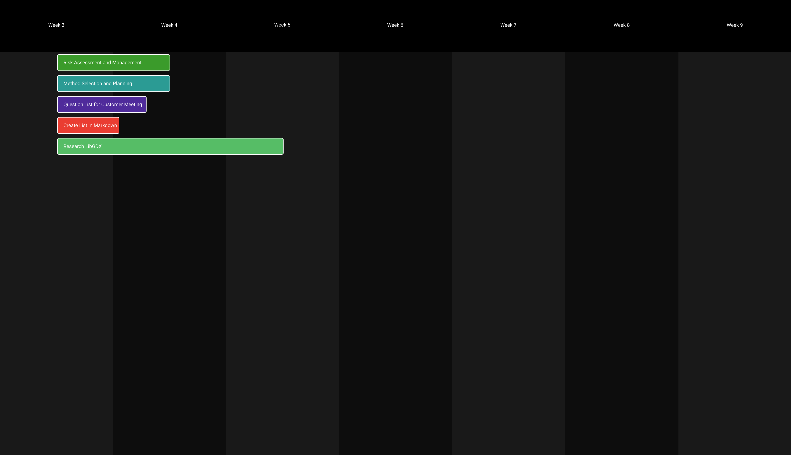
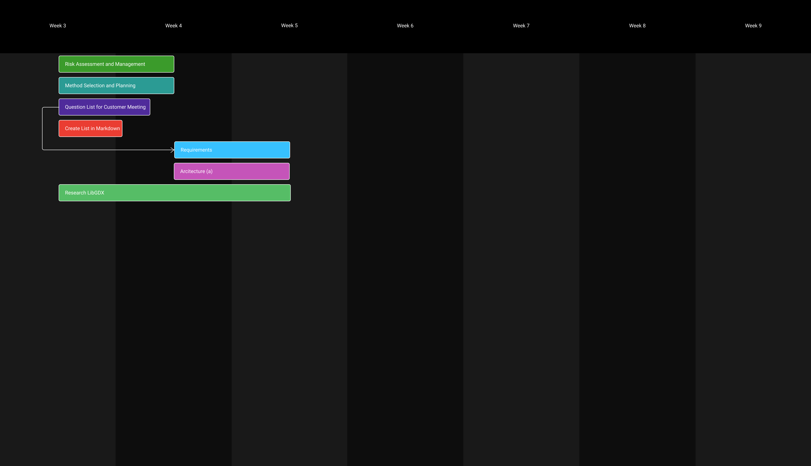
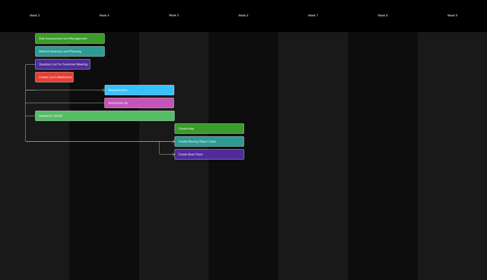
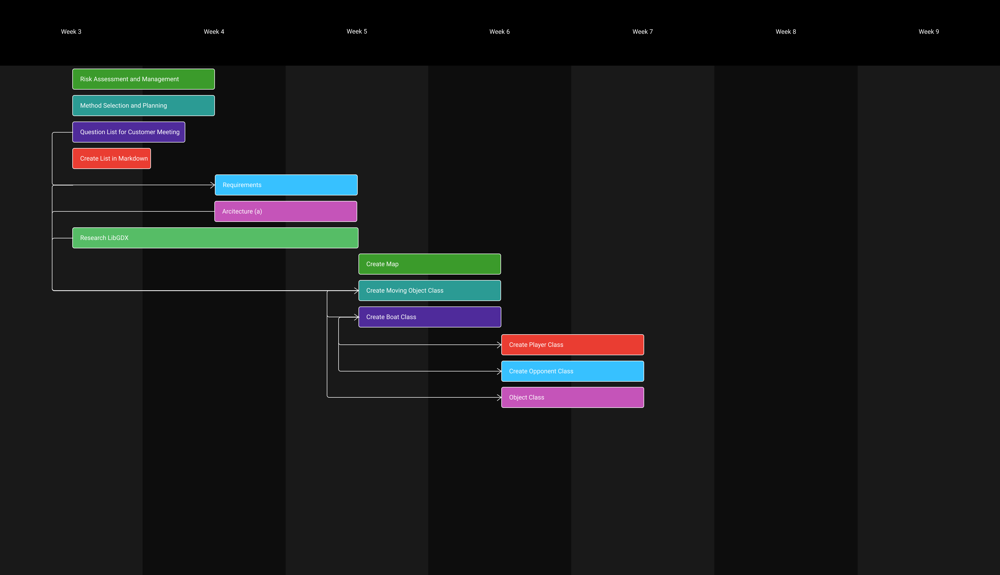
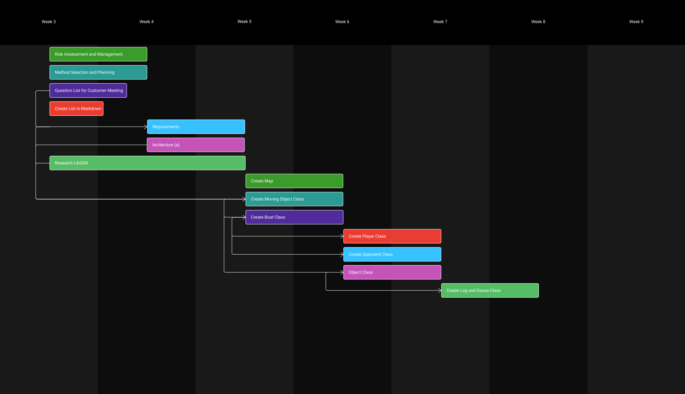
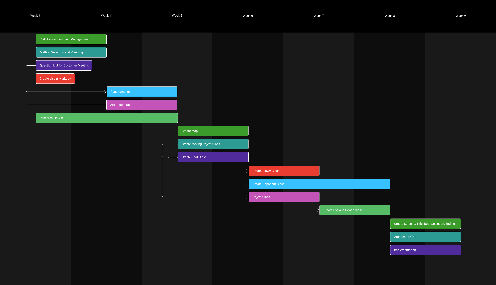

# Plan
For our plan, instances where deliverables have a set deadline on the chart indicate initial completion (that is, deliverables were revisited to make changes e.g. Risk assessment updated with new risks identified).
## Week 3

## Week 4

## Week 5

## Week 6

## Week 7

## Week 8
